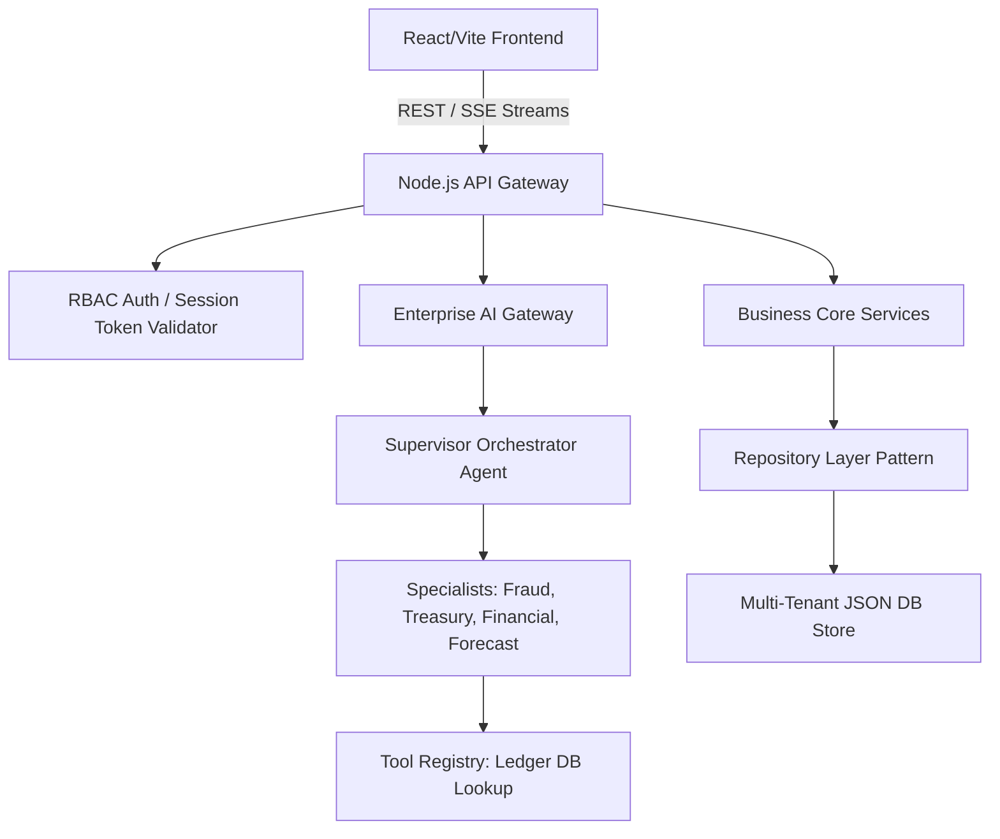

# FinOps AI Copilot

> Pluggable multi-tenant corporate finance orchestrator with specialist agents, automated fraud analysis, SSE streams, and visual ledgers.

FinOps AI Copilot is an enterprise-grade financial intelligence engine. It leverages specialized AI agents to analyze corporate ledger transactions, manage AP invoices, reconcile treasury bank balances, and flag payment security threats before execution.

## 🚀 Key Features

* **Enterprise AI Gateway**: Pluggable models (OpenAI, Gemini, Ollama) routed dynamically with token cost-evaluation counters.
* **Specialist Agent Personas**: Supervisor agent delegating complex financial, compliance, fraud, and forecasting workflows to specialists.
* **RAG Retrieval Engine**: Contextual search using hybrid TF-IDF lookups on corporate standard operating procedures and SOX guidelines.
* **Financial Intelligence Core**: Dynamic calculations for health ratings, 6-month cash forecasting trends, and P&L brief summaries.
* **Threat Scanner**: Weekend transaction traps, duplicate payment matches (within a 7-day window), and blocked vendor locks.

---

## 🛠️ Folder Structure

```text
├── apps/
│   ├── api/                   # Fast Node.js microservice architecture
│   │   ├── src/
│   │   │   ├── ai/            # Gateway, orchestrator, agents, memory & RAG
│   │   │   ├── core/          # Base models, Repository pattern, and EventBus
│   │   │   ├── modules/       # Invoices, Payments, Transactions, Vendors, and Intelligence
│   │   └── test/              # Integration and unit test runner suite
├── packages/
│   └── shared/                # Shared interfaces and verification validators
├── src/                       # Premium React/TS Vite frontend Dashboard
```

---

## 🏗️ Architecture



---

## ⚙️ Quick Start

```bash
# 1. Install dependencies
npm install

# 2. Run backend test suite
npm test

# 3. Build & start dev workspace
npm run dev
```

For comprehensive instructions, see [INSTALLATION.md](file:///c:/Users/M%20Prashant%20Rao/Downloads/AI%20Finance%20Project/INSTALLATION.md).